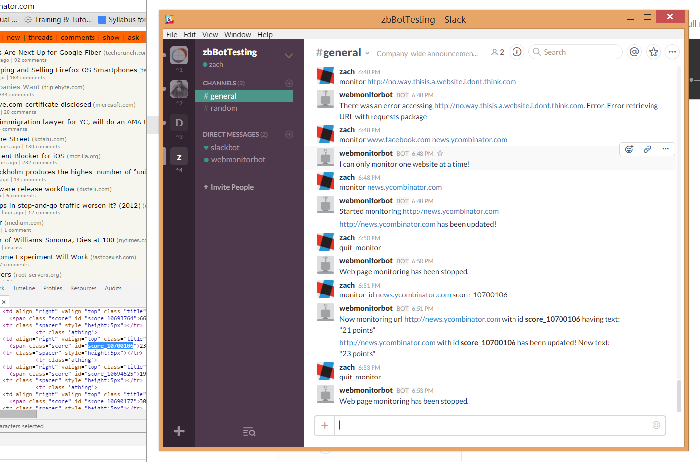

python-webpage-monitor-slackbot
=============
A slackbot that monitors webpages (or webpage elements) and provides notifications of any updates that occur.

Description
=============
WebMonitorBot is Slack's Python-based [real-time messaging bot](https://github.com/slackhq/python-rtmbot) which uses [BeautifulSoup](http://www.crummy.com/software/BeautifulSoup/bs4/doc/) to monitor changes in web pages.  Currently, it is hardcoded to check for web page updates every 30 seconds and produces a message when updates have occurred.  

Usage
=============
There are two ways to monitor web pages using the bot:  
* **monitor** *url*: the 'monitor' command points the bot at *url* and monitors the entire webpage.  However, many webpages have trivial dynamic content and are thus susceptible to displaying changes that are not meaningful. In such cases, this is not an ideal method to use. I'm working on a future release to try to discount much of this trivial content. This command will indicate when changes to the page have occurred but not display what the changes are.  
**Example:** monitor news.ycombinator.com  

* **monitor_id** *url id*:  the 'monitor_id' command points the bot at a specific, unique HTML ID on the webpage and only monitors changes to the text associated with that ID.  This is the preferred and generally more accurate method of webpage monitoring as it usually excludes unwanted junk.  This command will display the first 200 characters of the text associated with the ID when the web page changes. The 'id' is case-sensitive though the url and trigger word is not.
**Example:** monitor_id news.ycombinator.com score_10700106  
  
In both cases, the trigger word must be the first word in the message, and monitoring will not occur if additional words are added after the final input.
  
Other Methods
------------
* **quit_monitor**: stops any current webpage monitoring

Example Usage
------------
Below is an example of using webmonitorbot to monitor HackerNews, using both **monitor** for the entire page and **monitor_id** to check for score updates on a particular article:  

  
Dependencies
----------
* [websocket-client](https://pypi.python.org/pypi/websocket-client/)
* [python-slackclient](https://github.com/slackhq/python-slackclient)
* [BeautifulSoup4](http://www.crummy.com/software/BeautifulSoup/bs4/doc/)
* [requests](http://docs.python-requests.org/en/latest/)
* [dill](http://trac.mystic.cacr.caltech.edu/project/pathos/wiki/dill)

Installation
-----------

1. Download WebMonitorBot:

        git clone https://github.com/zbeaver4/python-webpage-monitor-slackbot.git
        cd python-webpage-monitor-slackbot

2. Install dependencies:

        pip install -r requirements.txt

3. Configure the bot ([Slack Instructions](https://api.slack.com/bot-users)). Go to Slack integrations, make a new Slackbot, and grab the token. Insert your token in the rtmbot.conf file (shown below), which should be copied to the main folder
        
        cp doc/example-config/rtmbot.conf .
        vi rtmbot.conf
          SLACK_TOKEN: "Insert_token_here"
          TRIGGER_WORD: "monitor"

4. Run the bot! Note, that the program must be running as long as you want to use it.  
        ```
        python rtmbot.py
        ```

####Todo:
* Add ability to filter junk HTML information for 'monitor' command
* Enable User to specify the frequency of web page checks
* Allow user to input web page text and have the bot infer the tree structure which contains the text, checking that tree structure in the future for changes.
* Add capability for monitoring multiple websites at once
* Make deployable in the clound (Heroku?)
* Add additional error checking for timed-out websockets
